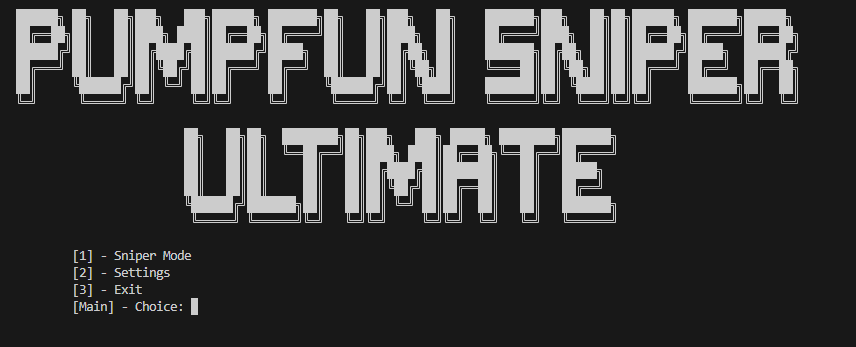
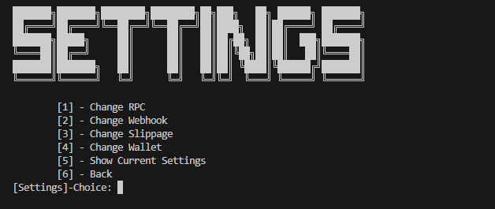
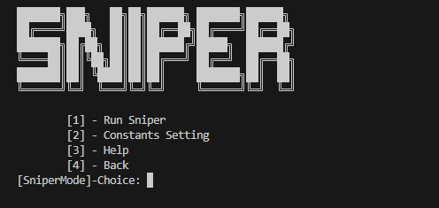
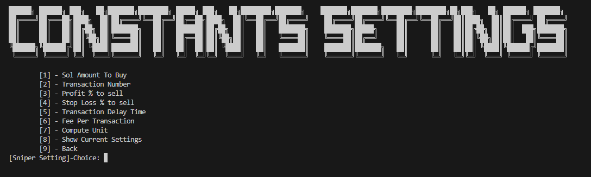
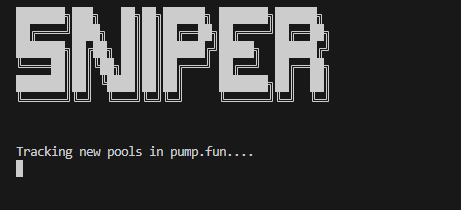
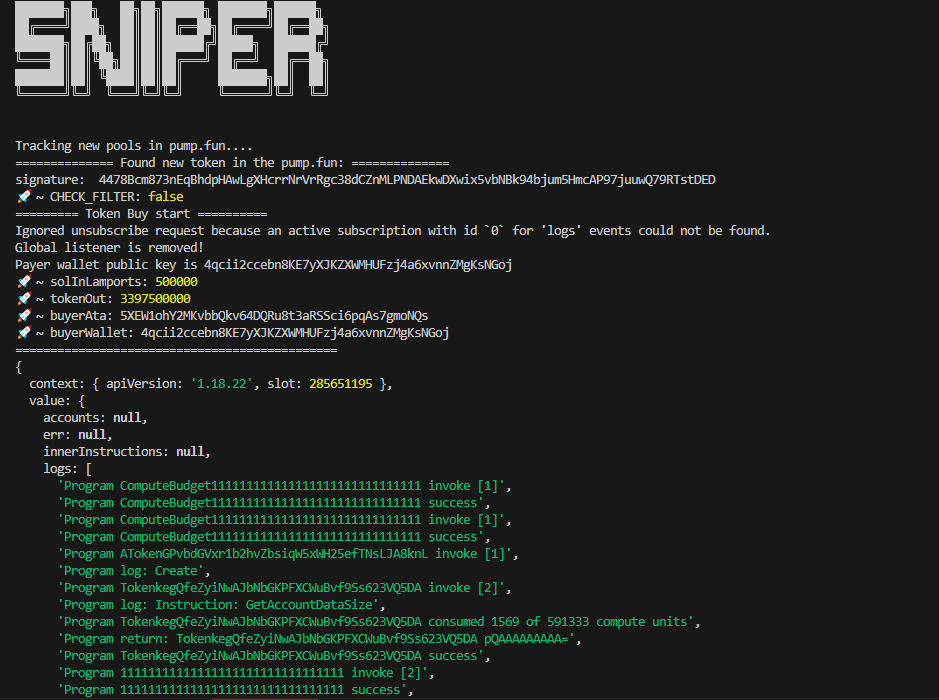
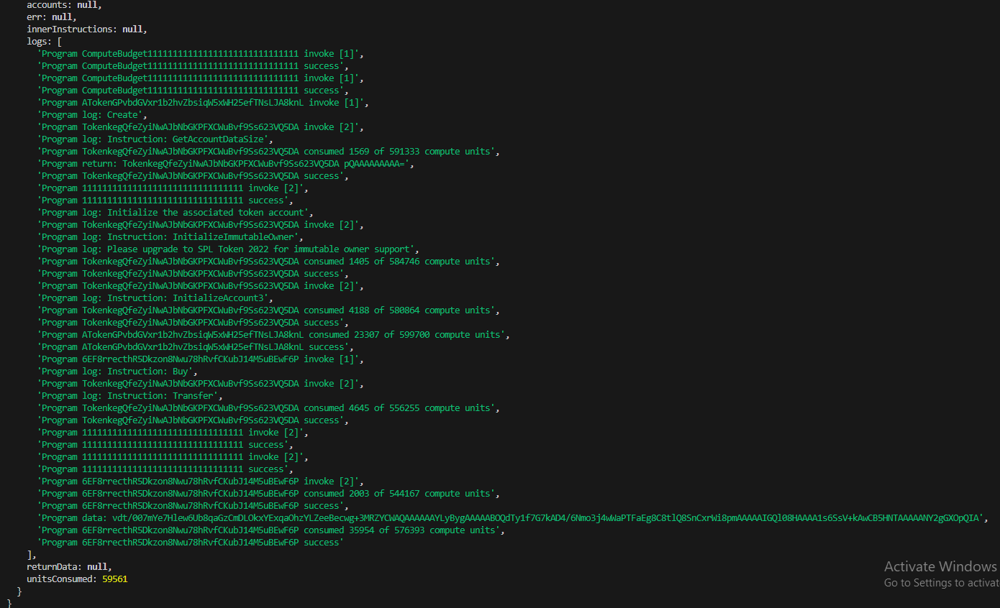

# Solana Pumpfun Sniper

### This public version includes only the buy feature of my sniper. You can test its speed in sniping new tokens with Pump.fun sniper. If you're satisfied, contact me to access the full version of my sniper.

## Clone Project

```bash
   git clone https://github.com/derricklee918/Sol-Pumpfun-SniperBot.git
   cd Sol-Pumpfun-SniperBot
   yarn
   ```

## Screenshots

<p>This is the first screen of the my Sniper.</p>



<p>This is the settings of my sniper.
You can set these constants.</p>



<p>This is the sniper mode of my sniper.</p>



<p>This is the constants settings of the sniper.
You can set these constants.</p>



<p>This is the starting of the sniper.</p>



<p>These are the steps of the sniping process.</p>





## Contact me
Telegram: [@dwlee918](https://t.me/@dwlee918)
X: [@dwlee918](https://x.com/@dwlee918)
